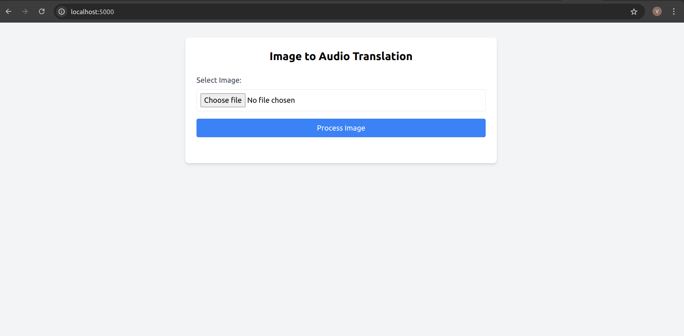
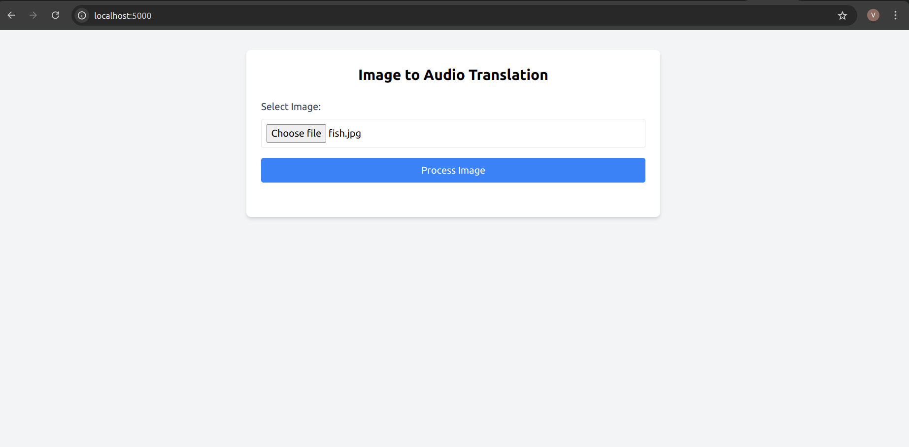
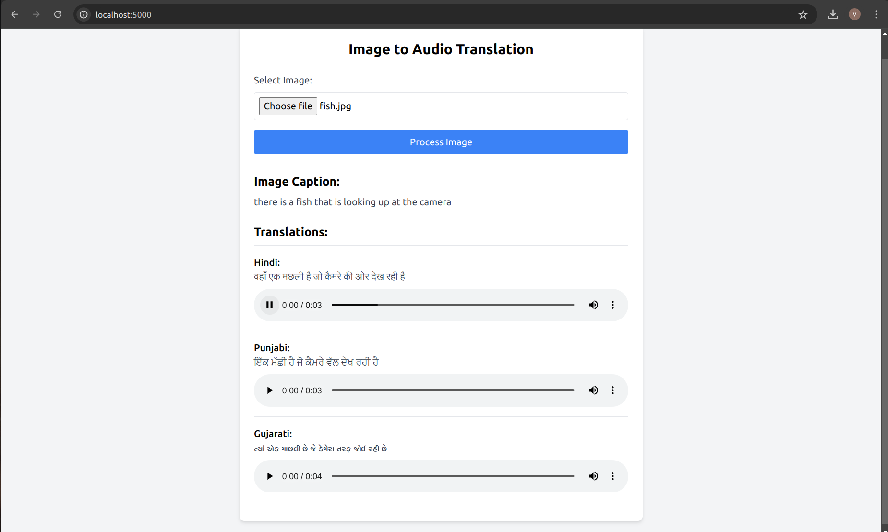

# image-to-indian-audio
### Vedansh Sharma, 12242000
Converts an image you upload to captions and gives audio files as well for Punjabi, Gujarati and Hindi

run "pip install -r requirements.txt" \
run "python3 app.py" \
open http://localhost:5000/

There, you'll get this page:

Choose your image:

Click on 'Process Image' to get results:

